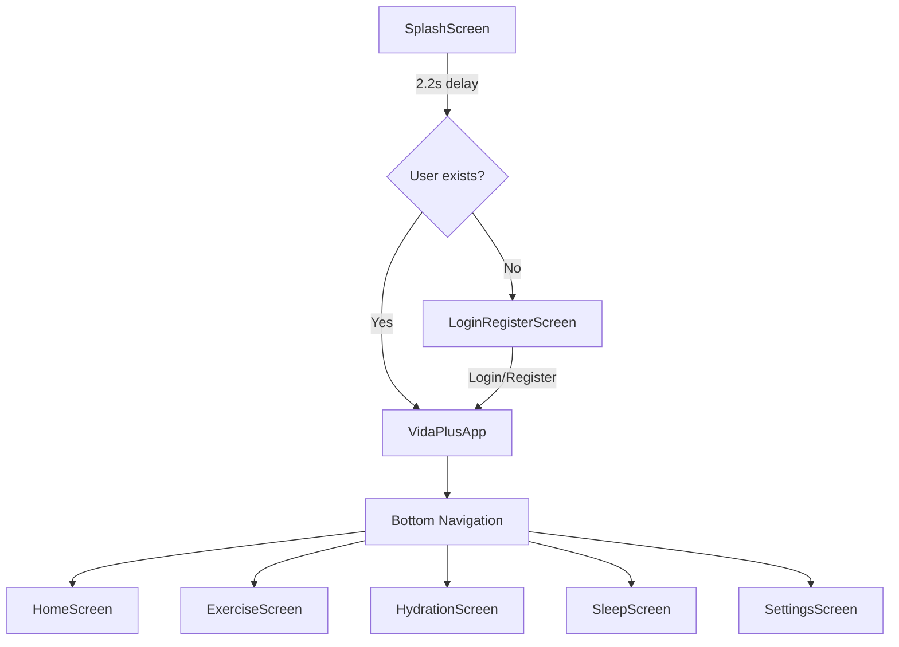

## Overview

Vitu follows a **single-file architecture** pattern where the entire application is contained in `main.dart` (6,698 lines). This is an unconventional but deliberate design choice optimized for rapid development and simplified deployment.

<Note>
  All application code resides in a single file: `lib/main.dart`. This includes UI components, business logic, data models, and service integrations.
</Note>

## Technology Stack

<ParamField path="Flutter SDK" type="string" default="^3.10.8">
  Core framework for cross-platform development
</ParamField>

<ParamField path="Material 3" type="UI Framework">
  Modern Material Design 3 theming with custom seed colors
</ParamField>

<ParamField path="Hive" type="NoSQL Database">
  Local-first storage using `hive` (^2.2.3) and `hive_flutter` (^1.1.0)
</ParamField>

<ParamField path="Gemini AI" type="AI Service">
  Google Generative AI (`google_generative_ai` ^0.4.0) for food analysis and recipe recommendations
</ParamField>

### Key Dependencies

```yaml
image_picker: ^1.1.2      # Camera/gallery access
path_provider: ^2.1.4     # File system paths
fl_chart: ^0.68.0         # Data visualization
geolocator: ^12.0.0       # Location tracking
sensors_plus: ^5.0.0      # Accelerometer for step counting
```

## Application Entry Point

The app initializes Hive boxes before launching the UI:

```dart lib/main.dart:21-31
Future<void> main() async {
  WidgetsFlutterBinding.ensureInitialized();
  await Hive.initFlutter();
  await Hive.openBox('users');
  await Hive.openBox('user_settings');
  await Hive.openBox('daily_exercise');
  await Hive.openBox('hydration_logs');
  await Hive.openBox('daily_hydration_summary');
  SystemChrome.setEnabledSystemUIMode(SystemUiMode.immersiveSticky);
  runApp(const MyApp());
}
```

<Warning>
  The `daily_sleep` box is opened lazily in `SleepScreen._initSleep()` rather than at app startup.
</Warning>

## Architecture Pattern: StatefulWidget

Every screen in Vitu uses the **StatefulWidget** pattern for managing local state and lifecycle:

### Screen Structure

```dart
class HomeScreen extends StatefulWidget {
  final Brightness brightness;
  final Color seedColor;
  final String? fontFamily;
  
  const HomeScreen({
    super.key,
    required this.brightness,
    required this.seedColor,
    this.fontFamily,
  });
  
  @override
  State<HomeScreen> createState() => _HomeScreenState();
}

class _HomeScreenState extends State<HomeScreen> {
  // Local state variables
  File? _photo;
  bool _analyzing = false;
  
  @override
  void initState() {
    super.initState();
    // Initialize data, start listeners
  }
  
  @override
  void dispose() {
    // Clean up resources
    super.dispose();
  }
  
  @override
  Widget build(BuildContext context) {
    // Build UI
  }
}
```

### State Management Strategy

<CardGroup cols={2}>
  <Card title="Local State" icon="memory">
    Each screen manages its own state using `setState()`. No global state management library is used.
  </Card>
  <Card title="Persistent Data" icon="database">
    All persistent data is stored in Hive boxes and retrieved synchronously on screen load.
  </Card>
</CardGroup>

## Navigation Flow



### Main Navigation Container

The `VidaPlusApp` widget manages bottom navigation with an `IndexedStack` to preserve state:

```dart lib/main.dart:319-420
class VidaPlusApp extends StatefulWidget {
  const VidaPlusApp({super.key});
  @override
  State<VidaPlusApp> createState() => _VidaPlusAppState();
}

class _VidaPlusAppState extends State<VidaPlusApp> {
  int _index = 0;
  Brightness _brightness = Brightness.light;
  Color _seedColor = const Color(0xFF80CBC4);
  String? _fontFamily;
  bool _followLocation = false;
  
  @override
  Widget build(BuildContext context) {
    return Scaffold(
      backgroundColor: background,
      body: IndexedStack(index: _index, children: pages),
      bottomNavigationBar: BottomNavigationBar(
        currentIndex: _index,
        onTap: (i) => setState(() => _index = i),
        items: items,
      ),
    );
  }
}
```

<Info>
  `IndexedStack` keeps all screens alive in memory, preserving scroll positions and local state when switching tabs.
</Info>

## Theming System

Vitu implements a **dynamic theming system** where users can customize:

<ParamField path="brightness" type="Brightness" default="light">
  Light or dark mode (stored in UserSettings)
</ParamField>

<ParamField path="seedColor" type="Color" default="0xFF80CBC4">
  Material 3 seed color for dynamic color schemes (ARGB int)
</ParamField>

<ParamField path="fontFamily" type="string" optional>
  Custom font family: `null`, `'serif'`, or other system fonts
</ParamField>

### Theme Application

The root `MyApp` widget uses a static theme, but individual screens receive theme parameters as constructor props:

```dart lib/main.dart:39-54
class MyApp extends StatelessWidget {
  const MyApp({super.key});

  @override
  Widget build(BuildContext context) {
    return MaterialApp(
      title: 'Vitu',
      debugShowCheckedModeBanner: false,
      theme: ThemeData(
        colorScheme: ColorScheme.fromSeed(seedColor: Colors.lime),
        useMaterial3: true,
      ),
      home: const SplashScreen(),
    );
  }
}
```

Each screen builds custom text styles using the theme parameters:

```dart
final heading = TextStyle(
  fontSize: 22,
  fontWeight: FontWeight.w800,
  color: isDark ? const Color(0xFFEDEDED) : const Color(0xFF111111),
  fontFamily: widget.fontFamily,
);
```

## Screen Lifecycle

### 1. Splash Screen

- Displays animated logo with scale and fade transitions
- Checks for existing user session in Hive
- Navigates to either `VidaPlusApp` or `LoginRegisterScreen` after 2.2 seconds

### 2. Authentication Flow

<Steps>
  <Step title="Login/Register">
    User enters credentials in `LoginRegisterScreen` with two tabs
  </Step>
  <Step title="Validation">
    Form validates email format and password presence
  </Step>
  <Step title="Storage">
    User data saved to Hive box with key `user:{email}`
  </Step>
  <Step title="Session">
    Current user email stored in Hive under key `currentUserEmail`
  </Step>
</Steps>

### 3. Main Application

Five screens accessible via bottom navigation:

<Tabs>
  <Tab title="Home (Nutrition)">
    - Food image capture and AI analysis
    - Nutritional breakdown with pie chart
    - AI-generated recipe recommendations
  </Tab>
  <Tab title="Exercise">
    - Step counting via accelerometer
    - Activity detection (walking/running/vehicle)
    - Weekly activity bar chart
    - Exercise routine suggestions
  </Tab>
  <Tab title="Hydration">
    - Water intake tracking (100ml/250ml/500ml buttons)
    - Dynamic daily goal calculation
    - Weekly consumption line chart
  </Tab>
  <Tab title="Sleep">
    - Automatic sleep detection (screen off 19:00-07:00)
    - Manual sleep entry
    - Quality rating (1-5 stars)
    - Weekly sleep bar chart
  </Tab>
  <Tab title="Settings">
    - Theme customization
    - User profile management
    - Hydration goal configuration
    - Password change
    - Logout
  </Tab>
</Tabs>

## Key Architectural Decisions

### Single-File Design

<AccordionGroup>
  <Accordion title="Advantages">
    - **Zero import complexity**: No circular dependencies or import management
    - **Rapid prototyping**: All code in one searchable file
    - **Simplified deployment**: Single compilation unit
    - **Easy debugging**: Ctrl+F to find any function/class
  </Accordion>
  <Accordion title="Trade-offs">
    - **Limited scalability**: Difficult to maintain beyond ~10k lines
    - **No code reusability**: Hard to extract shared components
    - **Merge conflicts**: High risk in team environments
    - **IDE performance**: Large files can slow down autocomplete
    - **Testing challenges**: Unit testing requires testing entire file
  </Accordion>
</AccordionGroup>

### No State Management Library

**Decision**: Use built-in `setState()` instead of Provider, Riverpod, or BLoC.

**Rationale**:
- App has minimal shared state (theme settings only)
- Each screen operates independently
- Data is loaded synchronously from Hive on each screen mount
- Avoids external dependency and learning curve

### Local-First with Hive

**Decision**: Use Hive NoSQL instead of SQLite or cloud database.

**Rationale**:
- No internet required for core functionality
- Zero boilerplate (no migrations, schemas)
- Synchronous reads for instant UI updates
- Type-safe with Dart's dynamic typing

<Warning>
  **Security Concern**: User passwords are stored in **plaintext** in Hive. This is acceptable for local-only apps but should use hashing (e.g., bcrypt) if adding cloud sync.
</Warning>

### External AI Integration

**Decision**: Use Google Gemini API instead of on-device ML models.

**Rationale**:
- No model training or maintenance required
- Access to state-of-the-art vision and language models
- Handles complex food recognition and recipe generation
- Trade-off: Requires internet and API key management

## Code Organization Within main.dart

Despite being a single file, code follows a logical structure:

```
main.dart (6,698 lines)
├── Imports & Utilities (lines 1-38)
├── App Entry Point (lines 39-54)
├── Data Models (lines 56-200)
│   ├── User class
│   ├── UserSettings class
│   └── Helper functions
├── Main Navigation (lines 319-420)
├── Screens (lines 448-4500+)
│   ├── HomeScreen (nutrition)
│   ├── ExerciseScreen
│   ├── HydrationScreen
│   ├── SleepScreen
│   └── SettingsScreen
├── Authentication (lines 3905-4300+)
│   ├── SplashScreen
│   ├── LoginRegisterScreen
│   └── Forms
└── Shared Widgets (scattered)
    ├── PressableScale
    └── Custom components
```

## Performance Considerations

<CardGroup cols={2}>
  <Card title="Positive" icon="bolt">
    - Hive provides O(1) key-value lookups
    - `IndexedStack` avoids rebuilding screens
    - Charts use efficient fl_chart library
    - Images stored on disk, not in memory
  </Card>
  <Card title="Concerns" icon="triangle-exclamation">
    - Large file size increases compile time
    - No code splitting or lazy loading
    - All screens loaded at app start
    - AI requests block UI thread during analysis
  </Card>
</CardGroup>

## Extension Points

To add new functionality:

<Steps>
  <Step title="Add New Screen">
    Create a new `StatefulWidget` class in main.dart
  </Step>
  <Step title="Add to Navigation">
    Add a new `BottomNavigationBarItem` and page in `VidaPlusApp`
  </Step>
  <Step title="Create Hive Box">
    Open a new box in `main()` if persistence is needed
  </Step>
  <Step title="Define Data Model">
    Create a class with `toMap()` and `fromMap()` methods
  </Step>
</Steps>

## Migration Path

If the app grows beyond this architecture:

1. **Extract data layer**: Move Hive logic to separate repository classes
2. **Add state management**: Introduce Riverpod or BLoC for complex flows
3. **Modularize screens**: Split into feature modules (auth, nutrition, exercise, etc.)
4. **Add testing**: Extract business logic into testable service classes
5. **Implement CI/CD**: Set up automated testing and deployment pipelines

---

<Card title="Next Steps" icon="arrow-right">
  Learn about the [Database Schema](/development/database) and [AI Integration](/development/ai-integration)
</Card>