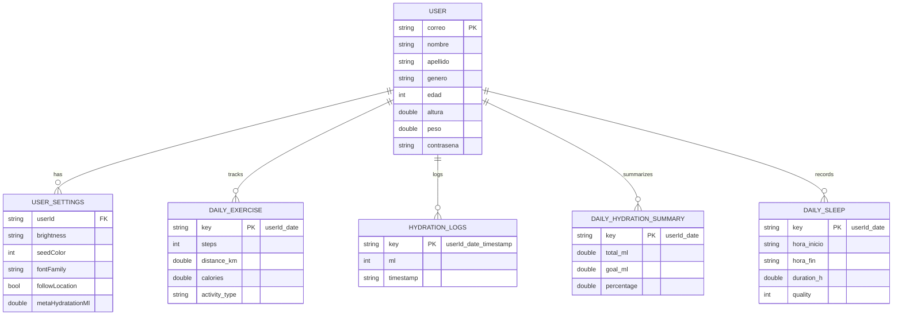

This page documents all data models and structures used in Vitu's local Hive database.

## Core models

### User

The `User` class stores account information and personal details for health calculations.

**Defined in:** `main.dart:56-125`

<ParamField path="nombre" type="string" required>
  User's first name
</ParamField>

<ParamField path="apellido" type="string" required>
  User's last name
</ParamField>

<ParamField path="genero" type="string" required>
  Gender: `"masculino"` or `"femenino"` (used for hydration goal calculation)
</ParamField>

<ParamField path="edad" type="int" required>
  Age in years (used for hydration goal adjustments)
</ParamField>

<ParamField path="altura" type="double" required>
  Height in centimeters
</ParamField>

<ParamField path="peso" type="double" required>
  Weight in kilograms (used for hydration goal calculation: weight × 35ml)
</ParamField>

<ParamField path="correo" type="string" required>
  Email address (used as unique identifier/primary key)
</ParamField>

<ParamField path="contrasena" type="string" required>
  Password (stored in plain text - **not recommended for production**)
</ParamField>

<ParamField path="brightness" type="string">
  Theme brightness: `"light"` or `"dark"`. Defaults to system preference if null.
</ParamField>

<ParamField path="seedColor" type="int">
  ARGB color value for Material 3 theme. Example: `0xFF8BC34A` for lime green.
</ParamField>

<ParamField path="fontFamily" type="string">
  Font family name: `null` (system default) or `"serif"`
</ParamField>

<ParamField path="followLocation" type="bool">
  Whether to use GPS for exercise tracking. Defaults to `false`.
</ParamField>

**Storage:**
- Box: `users`
- Key: `user:{correo}`
- Example: `user:john@example.com`

**Example:**

```dart
final user = User(
  nombre: 'Juan',
  apellido: 'Pérez',
  genero: 'masculino',
  edad: 28,
  altura: 175.0,
  peso: 70.0,
  correo: 'juan.perez@example.com',
  contrasena: 'securepassword123',
  brightness: 'dark',
  seedColor: 0xFF8BC34A,
  fontFamily: null,
  followLocation: true,
);

await _usersBox.put('user:${user.correo}', user.toMap());
```

---

### UserSettings

The `UserSettings` class stores user preferences separate from the User model.

**Defined in:** `main.dart:161-200`

<ParamField path="userId" type="string" required>
  User email (foreign key to User)
</ParamField>

<ParamField path="brightness" type="string">
  Theme brightness: `"light"` or `"dark"`
</ParamField>

<ParamField path="seedColor" type="int">
  ARGB color value for theming
</ParamField>

<ParamField path="fontFamily" type="string">
  Font family: `null` or `"serif"`
</ParamField>

<ParamField path="followLocation" type="bool">
  GPS tracking enabled for exercise
</ParamField>

<ParamField path="metaHydratationMl" type="double">
  Custom daily hydration goal in milliliters. If null, auto-calculated from weight/age/gender.
</ParamField>

**Storage:**
- Box: `user_settings`
- Key: `settings:{userId}`
- Example: `settings:juan.perez@example.com`

**Example:**

```dart
final settings = UserSettings(
  userId: 'juan.perez@example.com',
  brightness: 'dark',
  seedColor: 0xFF4CAF50,
  fontFamily: 'serif',
  followLocation: true,
  metaHydratationMl: 2500.0,
);

await _userSettingsBox.put('settings:${settings.userId}', settings.toMap());
```

---

## Daily data models

All daily data uses composite keys: `{userId}_{YYYY-MM-DD}`

### Exercise data

**Box:** `daily_exercise`  
**Key pattern:** `{email}_{date}`  
**Example key:** `juan.perez@example.com_2026-03-04`

<ParamField path="steps" type="int" required>
  Total steps counted for the day
</ParamField>

<ParamField path="distance_km" type="double">
  Distance traveled in kilometers (if GPS enabled)
</ParamField>

<ParamField path="calories" type="double">
  Estimated calories burned
</ParamField>

<ParamField path="activity_type" type="string">
  Current activity: `"stationary"`, `"walking"`, `"running"`, or `"vehicle"`
</ParamField>

<ParamField path="last_updated" type="string">
  ISO 8601 timestamp of last step count update
</ParamField>

**Example:**

```dart
final today = DateTime.now();
final key = 'juan.perez@example.com_${today.year}-${today.month.toString().padLeft(2, '0')}-${today.day.toString().padLeft(2, '0')}';

await _dailyExerciseBox.put(key, {
  'steps': 8543,
  'distance_km': 6.2,
  'calories': 320.5,
  'activity_type': 'walking',
  'last_updated': DateTime.now().toIso8601String(),
});
```

---

### Hydration logs

**Box:** `hydration_logs`  
**Key pattern:** `{email}_{date}_{timestamp}`  
**Example key:** `juan.perez@example.com_2026-03-04_1709553600`

Individual water intake events (e.g., +250ml at 14:30).

<ParamField path="userId" type="string" required>
  User email
</ParamField>

<ParamField path="ml" type="int" required>
  Milliliters consumed in this event (100, 250, or 500)
</ParamField>

<ParamField path="timestamp" type="string" required>
  ISO 8601 timestamp of when water was logged
</ParamField>

**Example:**

```dart
final now = DateTime.now();
final key = 'juan.perez@example.com_${now.year}-${now.month.toString().padLeft(2, '0')}-${now.day.toString().padLeft(2, '0')}_${now.millisecondsSinceEpoch}';

await _hydrationLogsBox.put(key, {
  'userId': 'juan.perez@example.com',
  'ml': 250,
  'timestamp': now.toIso8601String(),
});
```

---

### Hydration summary

**Box:** `daily_hydration_summary`  
**Key pattern:** `{email}_{date}`  
**Example key:** `juan.perez@example.com_2026-03-04`

Daily total of water consumed.

<ParamField path="total_ml" type="double" required>
  Total milliliters consumed for the day
</ParamField>

<ParamField path="goal_ml" type="double" required>
  Daily hydration goal (from user settings or auto-calculated)
</ParamField>

<ParamField path="percentage" type="double">
  Progress percentage: `(total_ml / goal_ml) * 100`
</ParamField>

**Example:**

```dart
final key = 'juan.perez@example.com_2026-03-04';

await _hydrationSummaryBox.put(key, {
  'total_ml': 1850.0,
  'goal_ml': 2450.0,
  'percentage': 75.5,
});
```

---

### Sleep data

**Box:** `daily_sleep`  
**Key pattern:** `{email}_{date}`  
**Example key:** `juan.perez@example.com_2026-03-04`

Sleep session recorded for a given night.

<ParamField path="hora_inicio" type="string" required>
  ISO 8601 timestamp of sleep start time (when screen turned off)
</ParamField>

<ParamField path="hora_fin" type="string" required>
  ISO 8601 timestamp of wake time (when screen turned on)
</ParamField>

<ParamField path="duration_h" type="double" required>
  Sleep duration in hours (clipped to 19:00-07:00 window)
</ParamField>

<ParamField path="quality" type="int" required>
  Sleep quality rating (1-5 stars). Auto-assigned based on duration:
  - Less than 6h: 2 stars
  - 6-8h: 4 stars
  - More than 8h: 5 stars
  
  User can edit this value.
</ParamField>

**Example:**

```dart
final key = 'juan.perez@example.com_2026-03-04';

await Hive.box('daily_sleep').put(key, {
  'hora_inicio': '2026-03-03T23:15:00.000Z',
  'hora_fin': '2026-03-04T07:30:00.000Z',
  'duration_h': 7.5,
  'quality': 4,
});
```

---

## Data relationships



## Key conventions

### Foreign keys

All daily data boxes use `userId` (the user's email) as a foreign key to relate data back to the user.

### Composite keys

Daily records use the pattern `{userId}_{YYYY-MM-DD}` to ensure:
- Unique keys per user per day
- O(1) lookups for specific dates
- No data collisions between users

**Example composite key generation:**

```dart
String getDailyKey(String userId, DateTime date) {
  return '${userId}_${date.year}-${date.month.toString().padLeft(2, '0')}-${date.day.toString().padLeft(2, '0')}';
}

final key = getDailyKey('juan.perez@example.com', DateTime.now());
// Result: "juan.perez@example.com_2026-03-04"
```

### Date formatting

Always use ISO 8601 format for timestamps:

```dart
final timestamp = DateTime.now().toIso8601String();
// Result: "2026-03-04T14:30:00.000Z"
```

### Type conversions

Hive stores data as maps with dynamic values. Always validate types when reading:

```dart
final rawData = _dailyExerciseBox.get(key);
if (rawData is Map) {
  final steps = (rawData['steps'] is int) 
      ? rawData['steps'] 
      : int.tryParse('${rawData['steps'] ?? 0}') ?? 0;
}
```

## Hydration goal calculation

The hydration goal is calculated automatically if `metaHydratationMl` is not set:

```dart
double calcularMetaHidratacion(User u) {
  final base = (u.peso > 0 ? u.peso : 70.0) * 35.0;
  var adj = base;
  if (u.edad < 14) adj = base * 0.90;
  if (u.edad >= 65) adj = base * 0.95;
  if (u.genero.toLowerCase() == 'masculino') adj += 200;
  return adj.clamp(1200.0, 4500.0);
}
```

**Formula:**
- Base: `weight × 35ml`
- Age less than 14: -10%
- Age 65+: -5%
- Male: +200ml
- Clamped: 1200-4500ml

---

## Related pages

- [Database schema](/development/database) - Learn about Hive box organization
- [Adding features](/development/adding-features) - Extend Vitu with new tracking features
- [Architecture](/development/architecture) - Understand the overall app structure
