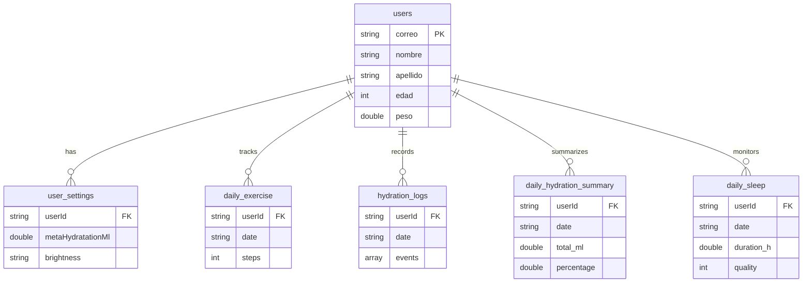

## Overview

Vitu uses **Hive**, a lightweight NoSQL database for Flutter, to store all user data locally. Data is stored as key-value pairs with values serialized as Dart Maps.

<Note>
  Hive is **not** a relational database. There are no tables, foreign keys, or SQL queries. All relationships are managed through naming conventions.
</Note>

## Database Initialization

All boxes are opened synchronously at app startup in `main()`:

```dart lib/main.dart:21-31
Future<void> main() async {
  WidgetsFlutterBinding.ensureInitialized();
  await Hive.initFlutter();
  await Hive.openBox('users');
  await Hive.openBox('user_settings');
  await Hive.openBox('daily_exercise');
  await Hive.openBox('hydration_logs');
  await Hive.openBox('daily_hydration_summary');
  SystemChrome.setEnabledSystemUIMode(SystemUiMode.immersiveSticky);
  runApp(const MyApp());
}
```

<Warning>
  The `daily_sleep` box is opened **lazily** in `SleepScreen._initSleep()` at lines 3639-3641.
</Warning>

## Box Accessors

Global getters provide typed access to boxes:

```dart lib/main.dart:127-131
Box get _usersBox => Hive.box('users');
Box get _userSettingsBox => Hive.box('user_settings');
Box get _dailyExerciseBox => Hive.box('daily_exercise');
Box get _hydrationLogsBox => Hive.box('hydration_logs');
Box get _hydrationSummaryBox => Hive.box('daily_hydration_summary');
```

## Box Schemas

### 1. users

Stores user profiles and authentication data.

<ParamField path="Key Pattern" type="string">
  - `user:{email}` - User profile data
  - `currentUserEmail` - Currently logged-in user's email
</ParamField>

#### User Data Structure

```dart lib/main.dart:56-125
class User {
  final String nombre;
  final String apellido;
  final String genero;
  final int edad;
  final double altura; // cm
  final double peso; // kg
  final String correo;
  final String contrasena; // simple local
  final String? brightness; // 'light' | 'dark'
  final int? seedColor; // ARGB int
  final String? fontFamily; // null | 'serif' u otras
  final bool? followLocation;
}
```

<ParamField path="nombre" type="string" required>
  User's first name
</ParamField>

<ParamField path="apellido" type="string" required>
  User's last name
</ParamField>

<ParamField path="genero" type="string" required>
  Gender: "masculino", "femenino", or custom
</ParamField>

<ParamField path="edad" type="int" required>
  Age in years (used for hydration goal calculation)
</ParamField>

<ParamField path="altura" type="double" required>
  Height in centimeters
</ParamField>

<ParamField path="peso" type="double" required>
  Weight in kilograms (used for hydration goal: peso * 35ml)
</ParamField>

<ParamField path="correo" type="string" required>
  Email address (used as unique identifier)
</ParamField>

<ParamField path="contrasena" type="string" required>
  **Plain-text password** (⚠️ security risk for production)
</ParamField>

<ParamField path="brightness" type="string" optional>
  Theme brightness: `"light"` or `"dark"`
</ParamField>

<ParamField path="seedColor" type="int" optional>
  Material 3 seed color as ARGB integer
</ParamField>

<ParamField path="fontFamily" type="string" optional>
  Font family: `null` (default), `"serif"`, etc.
</ParamField>

<ParamField path="followLocation" type="bool" optional>
  Whether to use location services
</ParamField>

#### Example Storage

```dart
// Stored in Hive at key "user:john@example.com"
{
  'nombre': 'John',
  'apellido': 'Doe',
  'genero': 'masculino',
  'edad': 28,
  'altura': 175.0,
  'peso': 70.0,
  'correo': 'john@example.com',
  'contrasena': 'password123',
  'brightness': 'dark',
  'seedColor': 0xFF80CBC4,
  'fontFamily': 'serif',
  'followLocation': true
}

// Current session pointer
'currentUserEmail': 'john@example.com'
```

### 2. user_settings

Stores user preferences and configuration.

<ParamField path="Key Pattern" type="string">
  `settings:{userId}` where `userId` is the email address
</ParamField>

#### UserSettings Data Structure

```dart lib/main.dart:161-200
class UserSettings {
  final String userId;
  final String? brightness;
  final int? seedColor;
  final String? fontFamily;
  final bool? followLocation;
  final double? metaHydratationMl;
}
```

<ParamField path="userId" type="string" required>
  Foreign key reference to user's email
</ParamField>

<ParamField path="metaHydratationMl" type="double" optional>
  Custom daily hydration goal in milliliters (overrides calculated goal)
</ParamField>

#### Default Hydration Goal Calculation

```dart lib/main.dart:202-209
double computeDailyHydrationGoalMl(User u) {
  final base = (u.peso > 0 ? u.peso : 70.0) * 35.0;
  double adj = base;
  if (u.edad > 0 && u.edad < 14) adj = base * 0.9;
  if (u.edad >= 65) adj = base * 0.95;
  if (u.genero.toLowerCase() == 'masculino') adj += 200;
  return adj.clamp(1200.0, 4500.0);
}
```

### 3. daily_exercise

Stores daily step counts and exercise activity.

<ParamField path="Key Pattern" type="string">
  `{userId}_{YYYY-MM-DD}` - Daily exercise summary
  `exercise_logs:{userId}` - Activity log entries
</ParamField>

#### Daily Exercise Schema

```dart lib/main.dart:1697-1708
{
  'userId': 'john@example.com',
  'date': '2026-03-04',
  'steps': 8543,
  'updatedAt': 1709567890123
}
```

<ParamField path="userId" type="string" required>
  User email (foreign key)
</ParamField>

<ParamField path="date" type="string" required>
  Date in `YYYY-MM-DD` format
</ParamField>

<ParamField path="steps" type="int" required>
  Total steps for the day
</ParamField>

<ParamField path="updatedAt" type="int" required>
  Timestamp in milliseconds since epoch
</ParamField>

#### Exercise Log Schema

```dart lib/main.dart:1724-1737
// Stored as array at key "exercise_logs:john@example.com"
[
  {
    'ts': 1709567890123,
    'type': 'steps',
    'steps_delta': 10
  },
  {
    'ts': 1709567895456,
    'type': 'activity:walking',
    'steps_delta': 0
  }
]
```

### 4. hydration_logs

Stores individual water intake events.

<ParamField path="Key Pattern" type="string">
  `{userId}_{YYYY-MM-DD}` - Array of intake events for the day
</ParamField>

#### Hydration Log Schema

```dart lib/main.dart:224-229
// Stored as array at key "john@example.com_2026-03-04"
[
  {
    'ts': 1709567890123,
    'ml': 250.0
  },
  {
    'ts': 1709571234567,
    'ml': 500.0
  }
]
```

<ParamField path="ts" type="int" required>
  Timestamp when water was logged (milliseconds since epoch)
</ParamField>

<ParamField path="ml" type="double" required>
  Amount of water consumed in milliliters
</ParamField>

### 5. daily_hydration_summary

Stores aggregated daily hydration totals and percentages.

<ParamField path="Key Pattern" type="string">
  `{userId}_{YYYY-MM-DD}` - Daily hydration summary
</ParamField>

#### Hydration Summary Schema

```dart lib/main.dart:260-267
{
  'userId': 'john@example.com',
  'date': '2026-03-04',
  'total_ml': 1750.0,
  'meta_ml': 2450.0,
  'percentage': 71.43,
  'updatedAt': 1709567890123
}
```

<ParamField path="userId" type="string" required>
  User email (foreign key)
</ParamField>

<ParamField path="date" type="string" required>
  Date in `YYYY-MM-DD` format
</ParamField>

<ParamField path="total_ml" type="double" required>
  Total water consumed today in milliliters
</ParamField>

<ParamField path="meta_ml" type="double" required>
  Daily goal in milliliters (from settings or calculated)
</ParamField>

<ParamField path="percentage" type="double" required>
  `(total_ml / meta_ml) * 100`, clamped to 0-100
</ParamField>

<ParamField path="updatedAt" type="int" required>
  Last update timestamp
</ParamField>

### 6. daily_sleep

Stores sleep sessions with automatic detection and manual entry.

<ParamField path="Key Pattern" type="string">
  `{userId}_{YYYY-MM-DD}` - Sleep data for the night ending on this date
</ParamField>

<Note>
  Sleep dates use the **date the user woke up**, not when they went to bed. A sleep session from 11 PM on March 3 to 7 AM on March 4 is stored under `2026-03-03`.
</Note>

#### Sleep Schema

```dart lib/main.dart:3741-3749
{
  'userId': 'john@example.com',
  'date': '2026-03-03',
  'hora_inicio': '2026-03-03T23:15:00.000Z',
  'hora_fin': '2026-03-04T07:30:00.000Z',
  'duration_h': 8.25,
  'quality': 4,
  'updatedAt': 1709567890123
}
```

<ParamField path="userId" type="string" required>
  User email (foreign key)
</ParamField>

<ParamField path="date" type="string" required>
  Date in `YYYY-MM-DD` format (date of waking up)
</ParamField>

<ParamField path="hora_inicio" type="string" required>
  Sleep start time in ISO 8601 format
</ParamField>

<ParamField path="hora_fin" type="string" required>
  Sleep end time in ISO 8601 format
</ParamField>

<ParamField path="duration_h" type="double" required>
  Total sleep duration in hours (can accumulate from multiple screen-off events)
</ParamField>

<ParamField path="quality" type="int" required>
  Sleep quality rating: 0-5 stars (0 = not rated)
</ParamField>

<ParamField path="updatedAt" type="int" required>
  Last update timestamp
</ParamField>

#### Automatic Quality Calculation

```dart lib/main.dart:3847-3851
int _initialQualityForHours(double h) {
  if (h < 6.0) return 2;
  if (h <= 8.0) return 4;
  return 5;
}
```

## Data Access Patterns

### User Authentication

```dart lib/main.dart:132-159
// Get current logged-in user's email
String? getCurrentUserEmail() {
  final v = _usersBox.get('currentUserEmail');
  if (v is String && v.isNotEmpty) return v;
  return null;
}

// Get user by email
User? getUserByEmail(String correo) {
  final raw = _usersBox.get('user:$correo');
  if (raw is Map) return User.fromMap(raw);
  return null;
}

// Get current user object
User? getCurrentUser() {
  final email = getCurrentUserEmail();
  if (email == null) return null;
  return getUserByEmail(email);
}

// Save user and set as current
Future<void> saveCurrentUser(User u) async {
  await _usersBox.put('user:${u.correo}', u.toMap());
  await _usersBox.put('currentUserEmail', u.correo);
}

// Verify login credentials
bool verifyLogin(String correo, String contrasena) {
  final u = getUserByEmail(correo.trim().toLowerCase());
  if (u == null) return false;
  return u.contrasena == contrasena;
}
```

### Date Key Generation

Consistent date formatting for composite keys:

```dart lib/main.dart:221-222
String _dateKey(DateTime d) =>
    '${d.year.toString().padLeft(4, '0')}-${d.month.toString().padLeft(2, '0')}-${d.day.toString().padLeft(2, '0')}';
```

Example: `2026-03-04`

### Adding Hydration

```dart lib/main.dart:224-268
Future<void> addHydrationMl(String userId, double ml) async {
  final today = _dateKey(DateTime.now());
  
  // 1. Append to event log
  final logKey = '${userId}_$today';
  final list = (_hydrationLogsBox.get(logKey) as List?)?.cast<Map>() ?? <Map>[];
  list.add({'ts': DateTime.now().millisecondsSinceEpoch, 'ml': ml});
  await _hydrationLogsBox.put(logKey, list);
  
  // 2. Update daily summary
  final summaryKey = '${userId}_$today';
  final raw = _hydrationSummaryBox.get(summaryKey);
  double total = 0.0;
  if (raw is Map) {
    total = (raw['total_ml'] is double) ? raw['total_ml'] : 0.0;
  }
  total += ml;
  
  // 3. Calculate percentage against goal
  final meta = settings.metaHydratationMl ?? computeDailyHydrationGoalMl(u!);
  final pct = ((total / meta) * 100).clamp(0, 100);
  
  await _hydrationSummaryBox.put(summaryKey, {
    'userId': userId,
    'date': today,
    'total_ml': total,
    'meta_ml': meta,
    'percentage': pct,
    'updatedAt': DateTime.now().millisecondsSinceEpoch,
  });
}
```

### Reading Weekly Data

Example from `HydrationScreen._load()`:

```dart lib/main.dart:3121-3138
final weekly = <double>[];
final now = DateTime.now();
for (int i = 6; i >= 0; i--) {
  final d = now.subtract(Duration(days: i));
  final key = '${u.correo}_${_dateKey(d)}';
  final r = _hydrationSummaryBox.get(key);
  double t = 0.0;
  if (r is Map) {
    t = (r['total_ml'] is double)
        ? r['total_ml']
        : double.tryParse('${r['total_ml'] ?? 0}') ?? 0.0;
  }
  final p = ((t / (_goal * 1000.0)) * 100.0).clamp(0.0, 100.0);
  weekly.add(p);
}
setState(() {
  _weeklyPercent = weekly;
});
```

## Data Relationships



## Key Patterns

### 1. Composite Keys for Daily Data

All daily tracking uses the pattern `{userId}_{YYYY-MM-DD}`:

```dart
// Exercise
'john@example.com_2026-03-04'

// Hydration
'john@example.com_2026-03-04'

// Sleep
'john@example.com_2026-03-04'
```

This allows:
- Easy date-based queries
- Automatic data isolation per user
- Simple day rollover (new key each day)

### 2. Prefix-Based Lookups

User-specific data uses prefixes:

```dart
// All users
'user:{email}'

// User settings
'settings:{email}'

// Activity logs
'exercise_logs:{email}'
```

### 3. Session Management

Single key for current session:

```dart
'currentUserEmail' -> 'john@example.com'
```

This is updated on login and checked on app start.

### 4. Data Aggregation

Separate boxes for raw events vs. aggregated summaries:

- `hydration_logs`: Raw intake events (list of {ts, ml})
- `daily_hydration_summary`: Computed totals (total_ml, percentage)

This enables:
- Fast dashboard queries (summary only)
- Detailed history when needed (full logs)
- Efficient updates (append to logs, recompute summary)

## Data Migration

<Warning>
  Hive does **not** have built-in migration support. Schema changes require manual handling.
</Warning>

To add a new field:

```dart
// Old schema
{'userId': 'john@example.com', 'steps': 5000}

// New schema (after code update)
{'userId': 'john@example.com', 'steps': 5000, 'distance_km': 0.0}

// Reading with fallback
final distance = (raw['distance_km'] is double)
    ? raw['distance_km']
    : 0.0; // Default for old data
```

## Performance Characteristics

<CardGroup cols={2}>
  <Card title="Fast Operations" icon="bolt">
    - **O(1) key-value lookups**: Direct Hive.box().get(key)
    - **No parsing**: Data stored as Dart objects
    - **Synchronous reads**: No async overhead
    - **Small data size**: Typical user has less than 1MB total
  </Card>
  <Card title="Slow Operations" icon="hourglass">
    - **No indexing**: Can't query by field values
    - **No joins**: Must manually relate data
    - **Full scans**: Iterating all keys in a box
    - **Writes**: Synchronous disk I/O blocks thread
  </Card>
</CardGroup>

## Best Practices

<Steps>
  <Step title="Always use composite keys">
    Never store daily data under a single key per user. Use `{userId}_{date}` for O(1) lookups.
  </Step>
  <Step title="Validate on read">
    Always check types and provide defaults:
    ```dart
    final steps = (raw['steps'] is int) ? raw['steps'] : 0;
    ```
  </Step>
  <Step title="Avoid large arrays">
    Don't append indefinitely to arrays (e.g., `exercise_logs`). Archive or paginate after 1000+ entries.
  </Step>
  <Step title="Batch writes">
    Group related updates to minimize disk I/O:
    ```dart
    await _hydrationLogsBox.put(logKey, list);
    await _hydrationSummaryBox.put(summaryKey, summary);
    ```
  </Step>
</Steps>

---

<Card title="Next: AI Integration" icon="robot" href="/development/ai-integration">
  Learn how Vitu uses Google Gemini for food analysis and recipe generation
</Card>